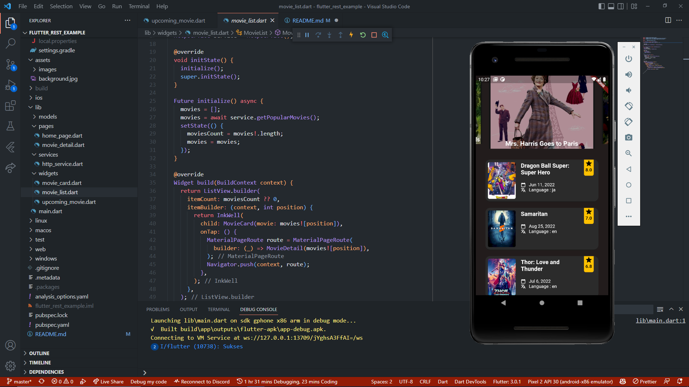
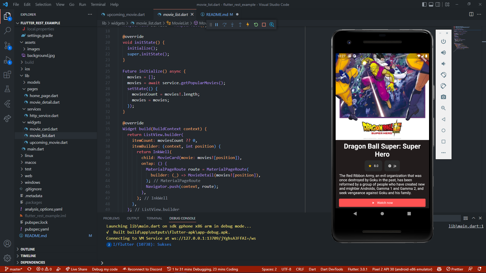

# flutter_rest_example

Praktikum Pertemuan 24 TSA Mobile Flutter Program - Penggunaan REST API dengan Flutter

# Screenshoot Project

Laman list film

Laman detail film

## Resource

API: https://www.themoviedb.org/documentation/api
 
UI: https://github.com/tustoz/netflix_redesign
